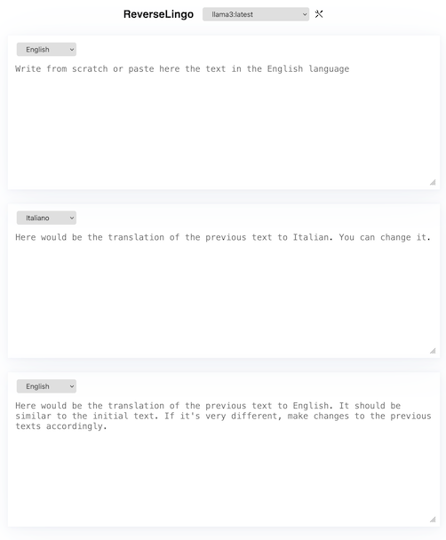

# ReverseLingo

Interface for two-way translation process, translating your text to the target language and back, ensuring your message is conveyed accurately

## Features

- No data is handled by the server in any way. Settings are stored in localStorage, and all requests are routed directly to your local `ollama` or your preferred external provider. No cookies or tracking of any kind.
- No dependencies apart from the LLM engine running locally. Just one file `index.html`, easy to fix and run.
- Ability to change prompts to customize responses.

## Installation

The simplest way to use this app is to run `ollama` locally on you machine.
If you don't have a local `ollama` installed yet, please, follow their [instructions](https://github.com/ollama/ollama) to install it. 

Next, you can download the `index.html` file from this repository
```sh
mkdir ReverseLingo
cd ReverseLingo
curl https://raw.githubusercontent.com/golomidov/ReverseLingo/master/index.html ./
```
or, clone the entire repository to a directory on your local machine (`ReverseLingo` for example)
```sh
git clone https://github.com/golomidov/ReverseLingo.git
cd ReverseLingo
```

Next, you can start within or point any web server to this directory.
Simplest way is to try any suitable receipts from [here](https://www.devdungeon.com/content/one-line-http-servers).

For example, if you choose Ruby, then just run
```sh
ruby -run -e httpd
```
and open with your browser the following local address [http://127.0.0.1:8080](http://127.0.0.1:8080)

You should see the following page:



Here is the text with some improvements for clarity and readability:
Write some English text into the first text area. After one second, it will start translating to Italian and the results will appear in the second text area. Immediately after that, the Italian text from the second text area will start translating back to English in the third text area.
The idea behind this is that it allows you to compare the "validity" of the Italian translation. If the reverse English translation is not very different from the initial message, the Italian translation is likely accurate.
If there are significant differences, you can either change the initial English text or fine-tune the Italian translation.
Of course, this can be done with any combination of languages, not just English and Italian. Select the desired language combinations from those offered in the corresponding text area.

## Live demo
If you have a local `ollama` installation, you can try the whole process with almost no additional steps.
However, first, you need to modify the way `ollama` is started.
Open the console and start `ollama` with the following command:
```sh
OLLAMA_ORIGINS=https://golom.it OLLAMA_HOST=0.0.0.0 ollama serve
```
This allows your browser to permit local requests from the specific host. It does not break any of your security settings and does not allow anyone else to access your machine. It is just for you.
After that, open your browser and navigate to the page `https://golom.it/ReverseLingo`.
That's it.
